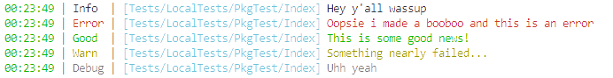

# Abbie
A simple, clean, javascript logger

[](https://travis-ci.com/jamesinaxx/Abbie)
[](https://deepscan.io/dashboard#view=project&tid=11350&pid=15794&bid=322083) 
[](https://codecov.io/gh/jamesinaxx/Abbie) 
[](https://badge.fury.io/js/abbie)

[](https://www.npmjs.com/package/abbie)

# Usage
It's literally as easy as 1, 2... No 3!
```
const logger = require('abbie');

logger.log('Sup folks!');
logger.log('YOU JUS GOT MONEY!', 'good');
logger.log('Nope... You just lost it all', 'error');
```
