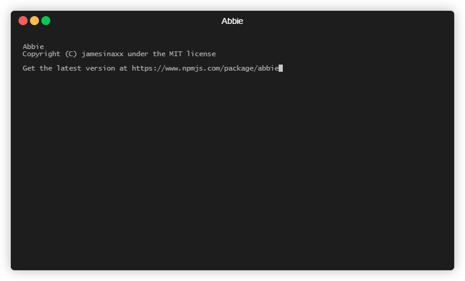

# Abbie

A simple, clean, javascript logger

[](https://opensource.org/licenses/MIT)
[](https://travis-ci.com/jamesinaxx/Abbie)
[](https://codecov.io/gh/jamesinaxx/Abbie) 
[](http://npmjs.com/abbie)



# Usage

It's literally as easy as 1, 2... Not even a 3!

**Please Note: This is my first npm package, ever! If something doesn't work, be patient, it will be fixed soon!**

```
// Basic Javascript version
const abbie = require('abbie');

abbie.log('Hey y'all wassup!');
abbie.log('Oopsie I made a booboo and this is an error', 1);
abbie.log('Finished Successfully!', 2);

// Typescript version
import { log } from 'abbie';

log('Hey y'all wassup!');
log('Oopsie I made a booboo and this is an error', 1);
log('Finished Successfully!', 2);
```

**For a more in-depth look at calling Abbie, check out [the wiki](https://github.com/jamesinaxx/Abbie/wiki/Reference)**

**Test it out on npm runkit [here](https://runkit.com/embed/g7az5h5ikphw)**

## Reference

```
message: 'Whatever... Literally any string', 

level?: 0 = info, 1 = error or 2 = good // This is not required and will just default to 0 if no value is given
```

## Roadmap

You can check out the development roadmap [here](https://github.com/jamesinaxx/Abbie/wiki/Roadmap)!

### Credits

* Developed by jamesinaxx
* With dependencies from [inxilpro](https://www.npmjs.com/~inxilpro) (app-root-path), [qix](https://www.npmjs.com/~qix) and [sindresorhus](https://www.npmjs.com/~sindresorhus) (chalk) 
